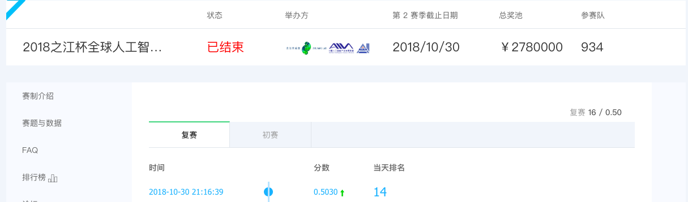
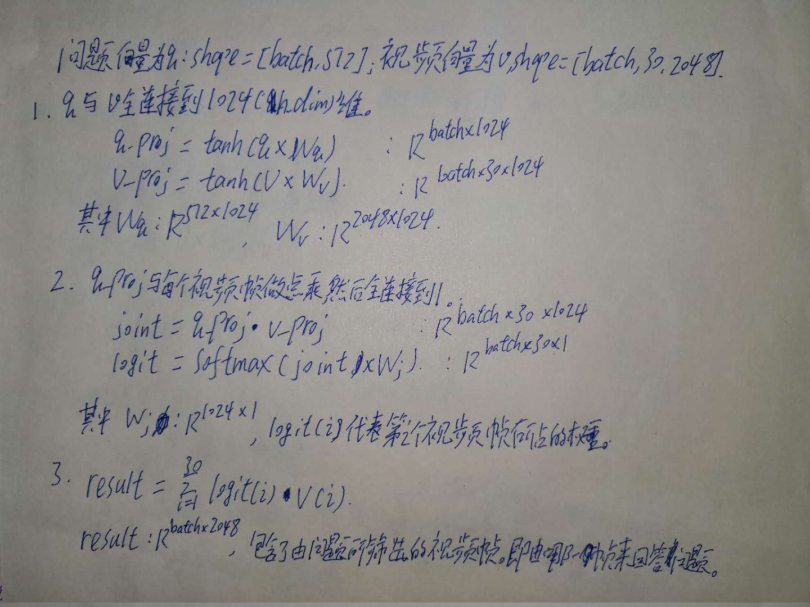
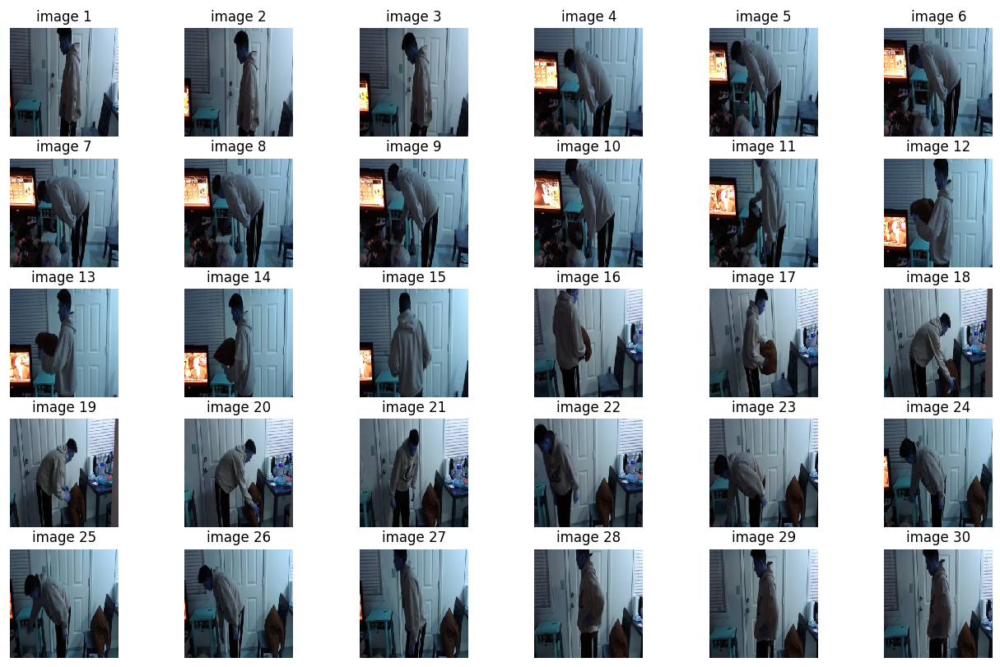

### 视频问答，video qa using keras。天池江之杯视频问答大赛
----
### 问题描述    
根据给定的短视频进行内容识别和分析，并回答每一个视频对应的问题。即给定一个视频，与任意的问题，模型根据视频对问题进行回答。
[比赛地址：https://tianchi.aliyun.com/competition/introduction.htm?spm=5176.11165320.5678.1.538b325ckj6OVi&raceId=231676 ](https://tianchi.aliyun.com/competition/introduction.htm?spm=5176.11165320.5678.1.538b325ckj6OVi&raceId=231676)

### 成绩
复赛第16名
<div align=center></div>  
----   
### 模型思路： 
- 总体思路：
	- a.句子通过lstm编码成1024维的向量；
	- b.视频均匀截取30帧后通过resnet152提取2048维的特征，通过句子向量对30个视频帧做attention。
	- c. 将attention后的视频向量与句子向量做融合（点乘），接上两个全连接到1000维。
	- d. 损失使用sigmoid，避免类间竞争，logloss。
	- e. 由于大部分答案都是重复的，故可以考虑成分类问题，选频率最高的1000个答案作为所有类别，对于不在1000个类别中的答案舍弃。每个问题有三个答案，故这是一个多标签问题。
- 对于问题句子，最大的句子长度为19，固定所有的句子长度维19（由于不是很长）。使用embedding成19*300的矩阵，通过隐藏层为512的双层lstm，得到的结果为512维向量，即为句子向量。
- 对于视频，均匀地截取30帧（第一名大佬好像是截取的关键帧），通过resnet152提取到2048维的特征。得到30*2048维的特征，使用句子向量对30个视频帧向量做attention。
    1. 将q全连接到[batch,h\_dim],将v全连接到[batch,30,h\_dim]
    2. q,v点乘。加上dropout,再使用一个全连接到1。[batch,30,1]
    3. L2标准化，softmax
 <div align=center>  </div>

4. 融合：将句子向量全连接到1024维，视频向量也全连接到1024维，对其进行点乘，tanh做为激活函数。再添加两个全连接，输出结果为1000为的向量对应答案的概率。    
5.  损失：由于这是多标签问题，使用sigmoid激活函数而不是softmax，避免标签类竞争(softmax相加等于1)。$loss = -y*log(y\_pred) - (1-y)*log(1-y\_pred)$

-------------------
### 模型改进residual block
原有的模型使用attention的方法是在多张图片中挑选一张最符合答案的图片，但是依然是使用一张图片回答问题，无法获得视频的动作特征。
我在这里尝试添加新的模型结构，以获取动作信息。
1. 对代表30张图片的30×2048的特征矩阵，在30这个方向做一维的卷积，filter size = 3。这样就相当与大小为3的窗口在30个特征上滑动，每次滑动都产生一个特征。由于结合了相邻的三张图片的信息，得到的特征可以反应动作信息。
2. 对特征做两次3*2048一维的卷积，由于这样可能打乱原有的静态特征。于是我们添加residual block，两次卷积之后加上原有的输入。  
<div align=center></div>  
3. 这样视频特征就能代表静态和动态的信息，接下来使用attention,模型其他部分不变。   
4. 结果大概提升0.5-1%。改进并不明显，可能是帧率不固定或者结构比较简单无法很好的学习到动作信息。

#### 其他尝试
 添加c3d网络用于获得动作信息，将c3d与resblock进行融合。并没有得到明显提高，可能c3d并不能很好的获取动作信息  

--------------------
### 训练细节，tricks
1. 训练时使用了lr reduce，当loss不在较小的时候，学习率下降10倍。
2. early stop，一定次数后loss不下降，就停止训练。
3. unfreeze，先不对词向量层训练。训练30个epoch后，再对解冻词向量层进行训练，能提高1-2个百分点。
4. 模型融合，训练30个模型，分别对测试集预测。并将得到的概率求平均，上升2-3个百分点。

--------------------- 
### 文件安排  
- 文件结构总结：       
```
 |- master
 	readme.md
 	|- pretrain_model
 		c3d						    #包含c3d的模型结构和模型参数,download from internet
 		resnet152					#包含resnet152的模型结构和模型参
 		c3d.py						#定义调用c3d的模型和预处理函数的方法
 		resnet152.py				#定义调用resnet152的模型和预处理函数的方法
 	|- utils
 		preteatment.py			#生成单词到词向量的对应关系，answer到编号的对应关系。将问题和答案编码后划分验证集和训练集
 		wordans_to_index.json	
 		embed_matrix.h5
 		train_encode.txt
 		val_encode.txt
 	|- data
 		|- glove.6B				#glove词向量，网上下载的
 		|- train
 		|- test
 		train.txt
 		test.txt
 	|- images
	 	|- image
	 	get_pic.py
	 	get_picc3d.py
 	|- attmfl_res  					#每个模型文件夹，包含视频特征读取文件，视频名对应的序号
 		get_feature.py				#提取对每个视频提取30个2048维的resnet特征，保存在feature/resnet 152中
 		 attention.py				#构造attention类
 		 model.py					#构造模型结构
 		 my_dataset.py			    #构造dataset类，产生迭代器，用于model.fit\_generator
 		attmflres.py				#根据dataset和model，生成并训练模型，为了使用模型融合，我们这里生成了30个模型（60epoch）
 		predict_prob.py			    #根据生成的模型，预测test集上的概率。
 		model						#存放生成的模型
 		prob_res					#预测测试集上的概率
 	...
   |- cnn_res                      #与attmfl_res的文件结构相同，模型增加了residual block部分
   ...
```

-----
### demo
#### 单个视频test:  
不想训练模型，只是运行模型看看效果的话，可以运行test.py文件。
- 将编码方式: wordans_to_index.json , embed_matrix.h5，模型，预训练模型下载放入对应文件。[链接](https://pan.baidu.com/s/1Srtzp5hGi_xbR5DzimLt3A)
- 命令：python test.py main --model_path='attmfl\_res/models/1'  --video= 'test/1.mp4' 
- 需要把模型下载到attmfl_res/models/1目录下面。视频放在test文件，当然也可以通过上面的命令自己指定路径
- 注：我在提交文件的时候，实际上使用了30个不同的模型分别预测，然后将预测的概率取平均的，结果大概高3个百分点（使用TTA可能效果更佳）。这里为了简便只使用一个模型。

 运行结果：
 
  <div align=center>  </div>  
- 输入question:	what is in the video  
- answer:	 television  
- 输入question:	where is the person in the video  
- answer:	 indoor  
- question:	what color clothes does the person wear in the video  
- answer:	 grey  

### train:
使用自己的视频和对应问题来训练模型：
1. 将train.txt和test.txt，视频，下载的glove词向量放在data文件夹下。[glove地址](http://nlp.stanford.edu/data/glove.6B.zip)
1. 运行image/get_pic.py，将每段视频截取30张图片，分成训练集和验证集放在images下。
2. 运行utils/pretreament.py将数据划分成训练集和验证集，并将问题与答案编码。
3. 运行attmfl\_res/get\_feature.py,将图片的resnet特征放到features/resnet152中。
4. 运行attmfl_res/attmflres.py开始训练。默认训练30个模型，每个模型训练60个epoch，前30个冻结embedding层，后30个解冻。

使用江之杯的数据   
1. 我将截取的图片和编码好的数据已打包上传至[链接]()，下载并解压到对应文件夹。
2. 运行attmfl\_res/get\_feature.py提取特征，和attmfl\_res/attmflres.py训练模型。


### test：
usage:
1. 运行attmfl\_res/predict_prob.py，用训练的30个模型分别预测test概率  
2. 运行merge_prob.py，融合预测的概率。并生成预测文件。
 

-----
### 文件预处理说明
- 在所有answers中取出现频率最高的前1000个作为所有类别。
- word\_to\_index决定了embed\_matrix的每行向量与单词的对应关系；ans\_to\_index和word\_to\_index决定了encode_data单词和答案的对应编码。而后续所有训练的模型都与其有关，一旦修改，所有模型将无效。生成之后谨慎修改。
- 下载的glove300词向量上包含40 0000个单词，而我们这个问题没有涉及那么多单词。所以调整词向量矩阵为只用出现过的单词。问题中出现部分错别单词不在词向量中，如：girl ->gril，我们使用enchant纠错。
- 编码词汇处理方案：
    - 将所有的questions的词汇进行纠错。question中的每个词如果不在glove中就按enchant的建议转换。
    - 然后将所有纠错的问题，提取出词汇。与glove的所有词汇做交集，生成vocabulary。
    - 这样保证了vocabulary包含了：1. 所有在glove的问题词汇 、2. 不在glove中的词汇，纠错后在glove中的词汇
    - 而纠错之后还不在glove中的词汇，在编码过程中就舍弃它（由于数量和出现次数都极少，直接舍弃没有影响）

-----
### 项目亮点   
1. 使用sigmoid + crossentropy来处理多标签问题，避免类间竞争。后续改进使用focal loss来针对训练困难样本。
2. 对每个视频截取30个图像，由于并不是每张图片都能回答问题。所以引入注意力的机制：“让问题来挑选能够回答它的图片”。
3.  对问题中的错误词汇，进行纠错。并合理构建词汇表而不是直接使用，错误的词汇构建词汇表。
4. 改变模型结构，增强residual block，让模型获得一些动作信息。
